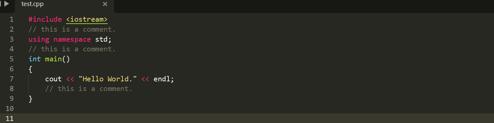
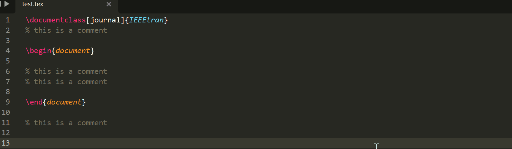

# Remove Comments

Sublime Text plugin: removes all comments in the current file based on syntax highlighting.

## Installation

Download or clone the contents of this repository to a folder named exactly as the package name into the Packages/ folder of Sublime Text.

## Keybindings
Located under Sublime Text > Preferences > Package Settings > Remove Comments > Key Bindings — User

- `ctrl+alt+shift+r` : remove all comments in the current file.
